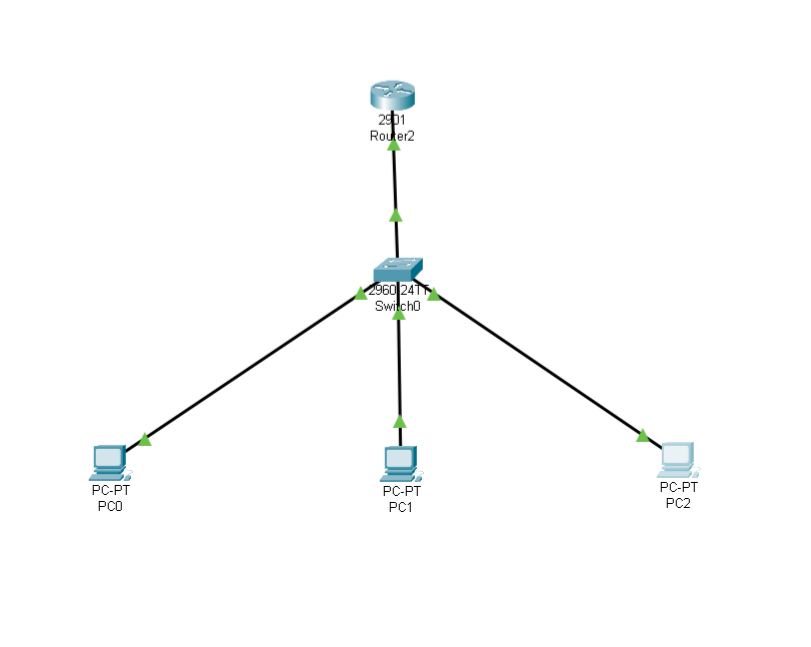
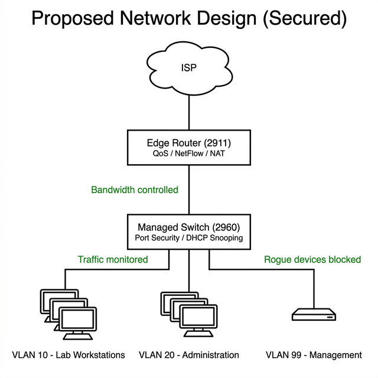

# Network Optimization and Security for a Shared Computer Lab

## 1. Problem Statement

A computer lab serving 50 workstations relies on a single ISP-provided router to share internet access. During peak hours, users experience severely degraded performance because there is no mechanism to control how bandwidth is distributed. Additionally, the network administrator has no visibility into which devices are consuming resources, and there is no access control to prevent unauthorized devices from connecting to the network.

This project addresses three critical problems:

| Problem | Impact |
|---------|--------|
| Uncontrolled bandwidth consumption | A small number of devices can saturate the entire link, degrading service for all users |
| No traffic visibility or monitoring | Administration cannot identify high-usage devices or diagnose congestion |
| No device access control | Any unauthorized device can connect freely, consuming shared resources and introducing security risks |

## 2. Proposed Solutions

Each problem is addressed by a specific, industry-standard network mechanism:

### 2.1 Bandwidth Management via Quality of Service (QoS)

The edge router is configured with QoS policies that enforce per-device rate limiting. Each workstation is capped at a defined maximum bandwidth (e.g., 2 Mbps), ensuring fair distribution of the shared internet link across all 50 machines.

### 2.2 Traffic Monitoring via NetFlow and SNMP

NetFlow is enabled on the edge router to export traffic flow records. In a production deployment, this data would be consumed by a monitoring platform (such as PRTG or Grafana) to generate real-time dashboards showing bandwidth usage by device, protocol, and time of day. SNMP polling provides interface-level statistics such as utilization, error rates, and packet counts.

### 2.3 Access Control via Port Security, DHCP Snooping, and VLAN Segmentation

The managed switch is configured with:

- **Port Security (Sticky MAC):** Each switch port learns and locks the MAC address of its assigned workstation. If an unknown device is connected, the port is automatically disabled.
- **DHCP Snooping:** Prevents rogue DHCP servers from assigning false IP configurations to workstations.
- **VLAN Segmentation:** The lab is placed in a dedicated VLAN to isolate its traffic from other parts of the campus network (e.g., administration, wireless guests).

## 3. Network Architecture

### 3.1 Current State (Baseline)



A flat network with no segmentation, no monitoring, and no access control.

### 3.2 Proposed State (Secured)



The redesigned network introduces VLAN segmentation, QoS rate-limiting on the edge router, NetFlow for traffic visibility, and Port Security with DHCP Snooping on the managed switch.

## 4. Repository Structure

```
/configs/        Cisco IOS CLI configuration scripts for the router and switch
/topology/       Cisco Packet Tracer (.pkt) simulation files
/diagrams/       Network architecture diagrams (current state and proposed state)
```

## 5. Tools Used

| Tool | Purpose |
|------|---------|
| Cisco Packet Tracer | Network simulation and testing |
| Draw.io / Diagrams.net | Architecture diagrams |
| Visual Studio Code | Configuration editing and documentation |
| Git / GitHub | Version control and project hosting |

## 6. References

- Cisco Systems, "Quality of Service Configuration Guide," Cisco IOS Documentation
- Cisco Systems, "Configuring Port Security," Cisco Catalyst Switch Documentation
- Cisco Systems, "Configuring DHCP Snooping," Cisco IOS Documentation
- Cisco Systems, "Configuring NetFlow," Cisco IOS Documentation
