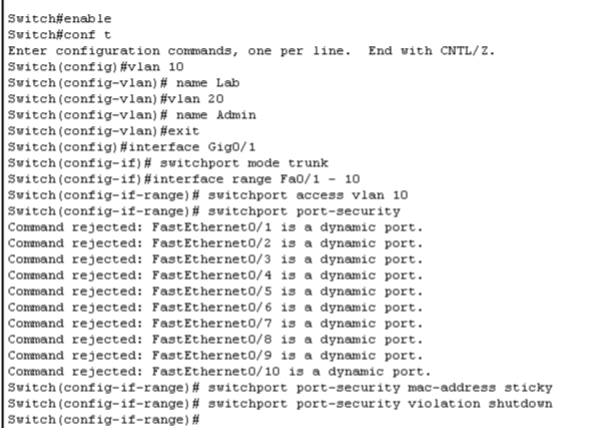

# Network Optimization and Security Project

## 1. What's this project about?

Our school computer lab has about 50 PCs sharing one internet connection. Right now, it's a bit of a mess. If one person starts a big download, everyone else's internet crawls. Plus, there's no way to see who's doing what, and anyone can just walk in and plug their own laptop into the wall and start using our bandwidth.

This project is my setup for fixing these three main issues:

| The Problem | Why it's annoying |
|-------------|-------------------|
| No Bandwidth Control | One heavy user can slow down the whole lab for everyone else. |
| Zero Visibility | The admin has no clue which machine is hogging all the data. |
| Security Risk | People can plug in personal devices that shouldn't be on the network. |

## 2. How I solved it

I've redesigned the network to be more secure and efficient using three main steps:

### 2.1 Managing Bandwidth (QoS)
I set up **Quality of Service** on the main router. This basically caps each seat at 2 Mbps, so no matter how big a file someone is downloading, there's always enough left for the other 49 students.

### 2.2 Traffic Monitoring (NetFlow)
I turned on **NetFlow** on the router. This keeps a log of where traffic is going and which IPs are the busiest. It's like having a security camera for our data.

### 2.3 Port Security & DHCP Snooping
On the switch, I locked down the ports. Using **Sticky MAC**, the switch remembers which PC belongs there. If you unplug the lab PC and put in a laptop, the port just shuts down. I also added **DHCP Snooping** so no one can mess with our IP address setup.

We're also using **VLANs** to keep the student lab separate from the administration and management traffic.

---

## 3. The Design

### 3.1 The "Before" State (Baseline)
[View Baseline Diagram](diagrams/current_network.png)

This is how the lab looks now, just one big flat network with no control and no security.

### 3.2 The "After" State (Secured)
[View Secured Diagram](diagrams/proposed_network.png)

My new design with the managed switch and the secure router setup. It’s segmented and much harder to mess with.

## 4. Seeing it in Action

I've tested everything in Cisco Packet Tracer. If you want to see how the security works:

1.  Open the [secured_network.pkt](topology/secured_network.pkt) file.
2.  Try unplugging a PC and connecting a Laptop to the same port.
3.  The port will turn **RED** immediately. That's the port security blocking the unauthorized device!

*Self-test: The port shutting down after I tried to plug in an unauthorized laptop.*

---

## 5. What's in this repo?

*   [**Configs Folder**](configs/) - The actual scripts for the router and switch.
*   [**Topology Folder**](topology/) - Packet Tracer files you can open and run.
*   [**Diagrams Folder**](diagrams/) - Screenshots of the setups and proof that it works.

## 6. Tools I used
*   **Cisco Packet Tracer** - For building and testing the whole simulation.
*   **Git & GitHub** - For version control and hosting the project portfolio.
*   **Markdown** - To write the technical documentation and presentation guide.
*   **Draw.io** - For making the clean network architecture diagrams.
*   **VS Code & PowerShell** - For editing the configuration scripts and managing the file structure.
